# Automatic Panoramic Image Stitching using Invariant Features

**********************Team ID : 8**********************

Shreyash Jain 2020101006

Gautam Ghai 2020101020

Mayank Bhardwaj 2020101068

# How to run the code

To run the code you can install the requirements using the following command:
    `pip install -r requirements.txt`

Then go to analysis.ipynb and change the args in the first cell to modify the settings of the code. Then call the `generate_results` function with the desired arguments and the folder name in the data folder. The results will be saved in the results folder.

# Introduction

In our project we have implemented the algorithm for automatic panoramic image stitching as described in the [paper](http://matthewalunbrown.com/papers/ijcv2007.pdf) titled "Automatic Panoramic Image Stitching using Invariant Features” by David and Lowe published in International Journal of Computer Vision(IJCV), 2007. Unlike the previous works that were done in the field of panoramic stitching, the algorithm described in the paper doesn’t require any user input in the form of initialisation such as for approximately aligning the images or providing the images of only a single panorama at a time and sending them in the correct order. The algorithm is robust to camera zoom, orientation of input images, and changes in illumination due to flash and exposure/aperture settings. It is also unaffected by how input images are arranged, oriented, scaled, and illuminated and can detect if multiple panoramas are present in the image set and create them.

# Implementation of the Algorithm

The following subsections describe the step by step implementation of the algorithm:

## 1. Feature Matching

- As the first step in panoramic recognition algorithm, we extract image features from all the n input images.
- Upon extracting the features for all n images each feature is matched to its k nearest neighbours in feature space in $O(nlogn)$ time by using a k-d tree to find approximate nearest neighbours.

## 2. Homography Estimation

- For one image we only consider its matches with best m images based on number of matches.
- RANSAC is used for Homography estimation by randomly sampling correspondences and selecting sets of r features to compute homography matrix H for n trials.
- For n = 500 and r = 4, probability that H is correct is very high. (pi is the inlier probability)

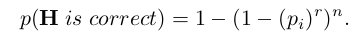

## 3. Match Verification

- At this stage, each pair of images consists of a list of features matches and an homography for one image relatively to the other. However, we don’t know yet which pairs of images should indeed overlap in the final panorama, and which pairs actually don’t have any area in common. To verify the image matches, we compare the features matches that are consistent with the homography (RANSAC inliers) with the features matches inside the area of overlap between the two images but not consistent (RANSAC outliers).
- The condition for an image match to be correct is given as:

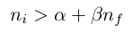

- Where,
    - $n_i$ = Number of inliers
    - $n_f$ = Number of features in overlapping area
    - $\alpha,\beta$ = constants (8.0, 0.3)
- The parameters α and β could theoretically been adjusted based on the data, but we used the provided values, that is $α$ = 8.0 and $β$ = 0.3.

## 4. Bundle Adjustment

Bundle adjustment is an essential step as the concatenation of pairwise homographies will lead to accumulated errors and disregard constraints between images (eg. ends of panorama should join up).  

- First, we create a matrix of `nxn` called `numMatches` where n is the total number of images of the dataset.
- `numMatches[i][j]` stores the negative of the number of feature matches between images i and j. We do this as this is required while implementing MST later.
- Next in the `bundleAdjuster` class we use the `buildNetwork` function to create a Graph using `numMatches` as the adjacency matrix.
- Then we divide all images into connected components based on their matches to one another. Consider a graph where each node is an image and the edge weights are the number of matches between two images. Each subgraph / connected component is treated as a separate panorama.
    - If a connected component has just a single node(i.e. a single image) we don’t store it in our list of connected components as these images are noise images that do not belong to a panorama.
- For each connected component we apply the Minimum Spanning Tree Algorithm to get the final tree. The edges that remain are the ones corresponding to the maximum number of feature matches (least edge weights) between the images. That is why the `numMatches` matrix was initialised with the negative of number of matches between 2 images.
- We then use the node with the highest degree(or highest number of matches with its neighbours, or it can be chosen randomly) as the source to get the parents of all other nodes and then apply Breadth First Search(BFS) from the source to get the order in which the images are added to bundle adjuster.
    - We apply BFS to generate the order because this method would ensure that when I add a new image, all the images this current image would require to be stitched into the frame of the source image would have already been rendered into the panaroma.
- For each panorama we store the path of images(order) and for each path we do the following
    - We initialise the homography for the first image(corresponding to the source node in the MST) as identity matrix. Then for the next image in the path we find its matches one by one with the previous images in the path. In case there is no match with a previous image we skip it.
    - If there is a match between the current and a previous image we store the feature points of the previous image transformed onto the source image’s frame. We also store the feature points of the current image.
    - The transformation is done using the homography matrix which is the multiplication of homography matrix of the current image with its parent recursively till we get to the source.
    - We initialize a matrix `H_init` in the same way by multiplying the homography matrix between the current image and its parent image recursively till we reach the source.
    - This is used as the initial estimate of H which is then optimized using the LM algorithm by calculating residual using the Huber robust error function.
    - The error function uses the `H_init` to transform the feature points of the current image into the source image frame and calculates the error between these points with it matching feature points in other images stored before. We are trying to minimize this error using the LM optimization algorithm.
    - This way we get the value of H when adding current image to the panorama consisting of all the previously added images.
    - H obtained for each of the images when they are matched with the previous images is finally stored and returned.

## 5. Gain Compensation

Gain compensation is an essential process in automatic panoramic image stitching to ensure a seamless and uniform illumination level across all images. This process can be performed by adjusting the brightness and contrast of each image in the overlap region, where the images are stitched together. The following is an overview of how the gain compensation algorithm works: 

- The **`gainCompensation`**function takes in the list of images to be stitched, matches, homographies, and sigma values for normalized intensity error and gain.
- The function first calculates the coefficients and results for each image using the **`setOverlap`**and **`setIntensities`**functions where :
    - **`coefficients`**is a 3-dimensional numpy array of shape **`(n_images, n_images, 3)`** where **`n_images`** is the number of images in the panorama and **`3`**corresponds to the number of color channels (R,G,B) in the images. The element **`coefficients[i][j][c]`**of the array corresponds to the coefficients for the **`c`**th color channel when computing the gain compensation for the **`j`**th image due to the overlap with the **`i`**th image.
    - **`results`** is a 2-dimensional numpy array of shape **`(n_images, 3)`** where the second dimension of size **`3`**corresponds to the three color channels (R,G,B). The element **`results[i][c]`** corresponds to the sum of the pixel values in the **`c`**th color channel of the **`i`**th image in the overlap region with other images.
    - Both **`coefficients`**and **`results`** are used to solve a linear system of equations that will compute the gain compensation for each image in the panorama.
- The **`setOverlap`** function computes and sets the overlap region between two images using a mask and warping one of the images with the homography matrix.
- The **`setIntensities`**function calculates the intensities of the two images in the overlap region and returns the result.
- The `**coefficients**` and `**results**` are then used to solve for the gain values using linear algebra in the **`gains`**array.

## 6. Multi Band Blending

Multi-band blending is a technique used in computer vision to create seamless panoramic images from multiple overlapping images. It divides each image into a series of frequency bands and blends each band separately to avoid blurring edges.

The multi-band blending algorithm takes a list of input images and performs the following steps:

- Compute the maximum weights matrix for the given images:
    - The `**weights matrix**` indicates how much each pixel in each input image should contribute to the final panorama. This matrix is initialized to **`None`**.
    - The **`add_weights`** function computes the contribution of each input image to the weights matrix by finding the homography of the current image and warping its weight mask into the panorama space. The updated weight matrix is returned along with an updated offset matrix.
    - The `**getMaxWeightsMatrix**` function computes the maximum weights matrix by taking the maximum value of the weights matrix for each pixel across all input images. This matrix is then segmented based on threshold so that each pixel is either 0 or 1.
- Convert the global weights matrix to a list of weights matrices for each image:
    - The **`get_cropped_weights`** function converts the global weights matrix to a list of weights matrices, where each weight matrix is the size of the corresponding image.
- Create a set of Gaussian pyramid bands for each input image:
    - A Gaussian pyramid is a multi-resolution image representation that is obtained by repeatedly convolving the image with a Gaussian kernel and downsampling the result.
    - The `**multiBandBlending**` function uses the **`cv2.pyrDown`** function to create a set of Gaussian pyramid bands for each input image. The number of bands is determined by the **`num_bands`** parameter.
- Perform multi-band blending:
    - The **`build_band_panorama`** function performs multi-band blending by combining the Gaussian pyramid bands of each input image based on their weights matrices.
    - The final panorama is obtained by dividing the combined bands by the combined weights.

# Results of Experiments and Analysis

First, one of the difficulties of this problem is that there is no real way to evaluate an image stitching algorithm. Unlike a problem of classification or regression, there is no metric (or at least no metric that is being widely used and accepted), and methods are often compared on specific examples that showcase the differences between the panoramas (distortion of the shapes, misalignment, etc.). Therefore, we proceed in the same way, by showing the effect of the algorithm on a few examples rather than by providing numbers.

## 1. Experimenting with Gain Compensation

The authors of the paper have extended their previous work in their 2003 [paper](http://matthewalunbrown.com/papers/iccv2003.pdf) titled “Recognising Panoramas” by incorporating Gain Compensation in their algorithm. From the following results we can clearly see that when we use Gain Compensation, it makes the image intensity uniform throughout the image whereas in the without Gain Compensation case it can be observed that different parts of the image have different levels of brightness.

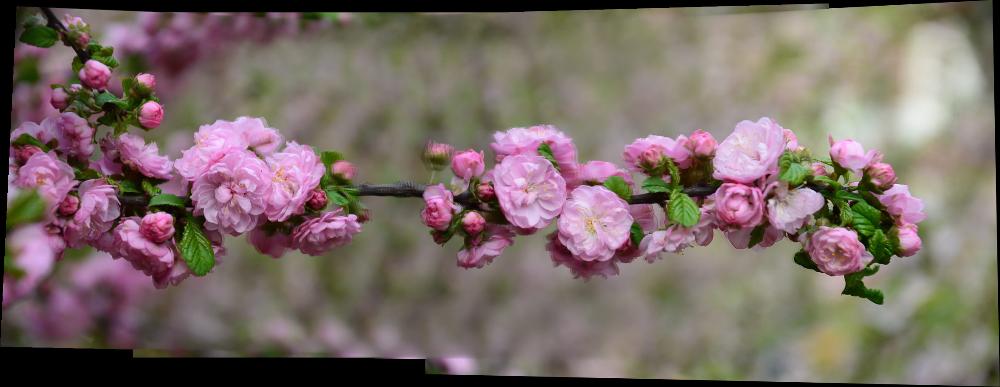

Without Gain Compensation

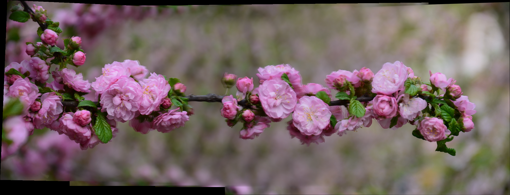

With Gain Compensation

In the above example while going from left to right, one can observe the varying intensity across the image in both cases.

## 2. Experimenting with Linear vs Multi Band Blending

Multi band blending is done to remove some edges that might be still visible even after gain compensation due to unmodelled effects such as parallax, radial distortion and also vignetting, where the intensity decrease towards the edge of the image. We have experimented with 2 techniques of blending images- Linear and Multi Band Blending with the following results:

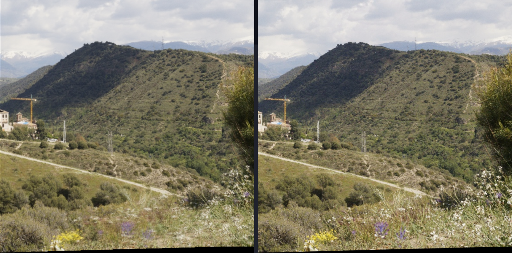

Linear Blending(left) and Multi Band Blending(right)

If we observe clearly it can be seen that towards the bottom of the image(near the yellow and purple flowers), there is a significant degree of blurring in the panorama with Linear Blending while this blurring has been resolved in the panorama with Multi Band Blending. This is in line with what the authors have mentioned in the paper that using Linear Blending can cause blurring of high frequency detail if there are small registration errors. It is to prevent this that they have used Multi Band Blending in the algorithm. Our results confirm the same.

Multi Band Blending

Linear Blending

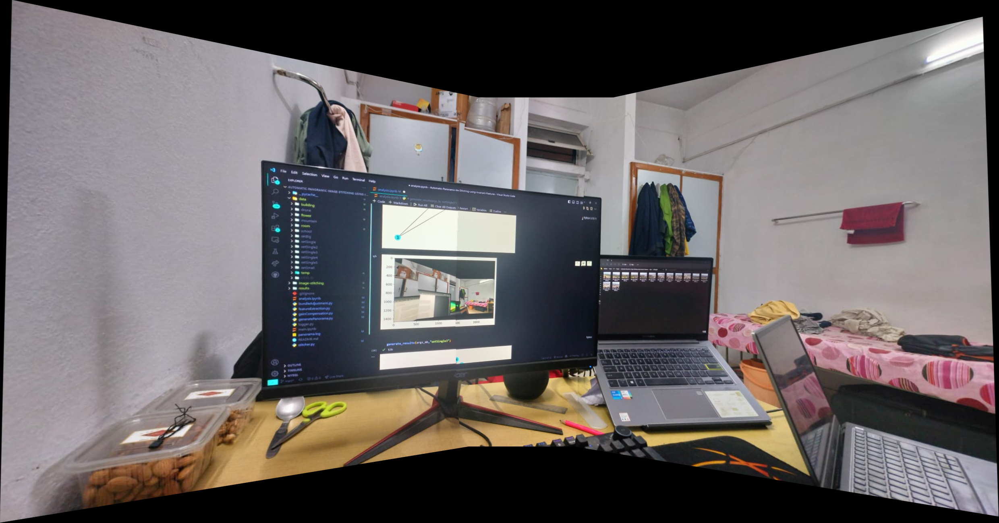

Multi Band Blending

Linear Blending

## 3. Experimenting with different values of $\sigma$ in Multi Band Blending

$\sigma$ refers to the standard deviation of the Gaussian filter used to create the pyramid of multi-band blending which is further used to calculate $\sigma'=\sqrt(2k+1)\sigma$ which is standard deviation of the Gaussian blurring kernel. We tried experimenting with different values of $\sigma$ and we got the following results.

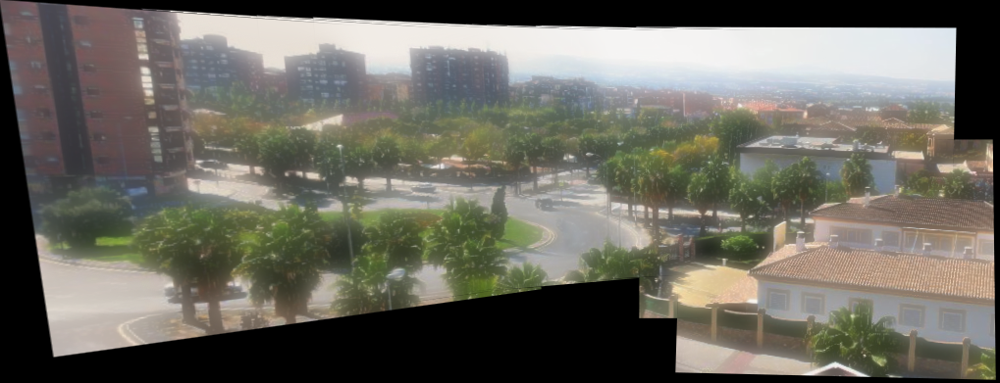

$\sigma$=2

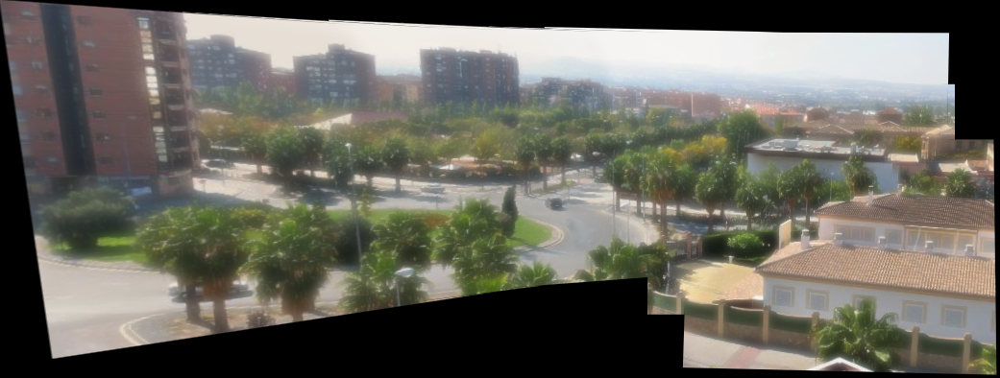

$\sigma$=1

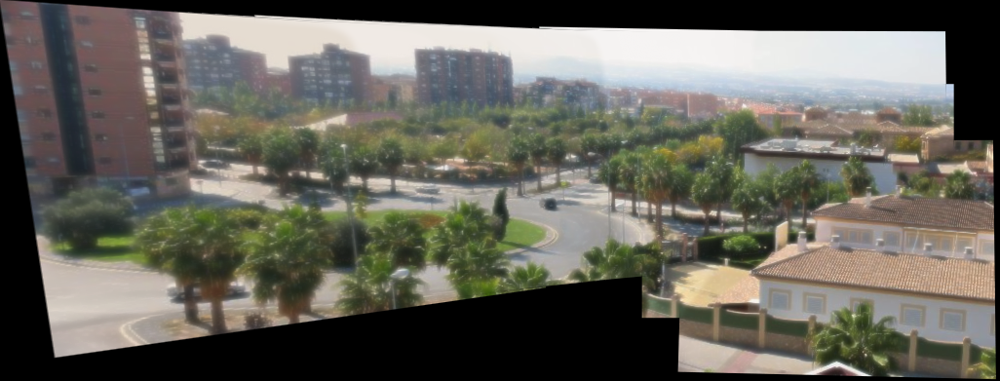

$\sigma$=0.5

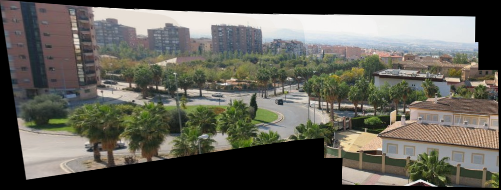

$\sigma$=0.1

We observe that the blurring decreases with decrease in the value of $\sigma$. With reduced sigma, we are effectively increasing the size of the Gaussian filter. This results in a wider frequency range being included in each band of the pyramid. A larger value of $\sigma$ tends to get rid of more noise in the image but it also can lead to loss of details due to which the sharpness of the image will decrease and blurring will increase. 

The time taken increases with decrease in value of $\sigma$

## 4. Experimenting with Start Point in Bundle Adjustment

As explained before in Bundle Adjustment we find the source node(image) in the MST graph to get the best matching image to be added to bundle adjuster. All the other images are then transformed into the perspective of this source image for the purpose of stitching. We have used 3 ways to identify this source node in our MST graph: degree(number of nodes to which a node is connected in the graph),number of matches between a node(image) with all other images or assigning the source node randomly. In case of the first 2 methods, the node with highest degree(or the highest number of matches with other images) becomes the source node which has been highlighted in green in the following MSTs.

We experimented with all the 3 methods to obtain the source to get the following networks and their corresponding panoramas. In this particular image dataset we had 10 images with the image 0 being the leftmost one in the panorama and image 8 being the right most one.

However, for the degree and matches methods we did not get any difference in the resulting panorama. This is because the MST itself is made by using number of matches as weights and so it is highly likely that the node with the highest degree will also have the highest number of matches with its neighbours than any other node. 

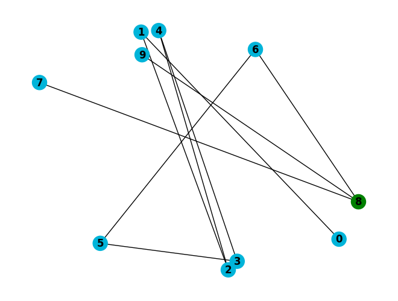

Panorama obtained with 8 as the source node obtained using the degree method. Notice that all the images have been transformed into the rightmost image’s perspective. Similar result was obtained for matches method

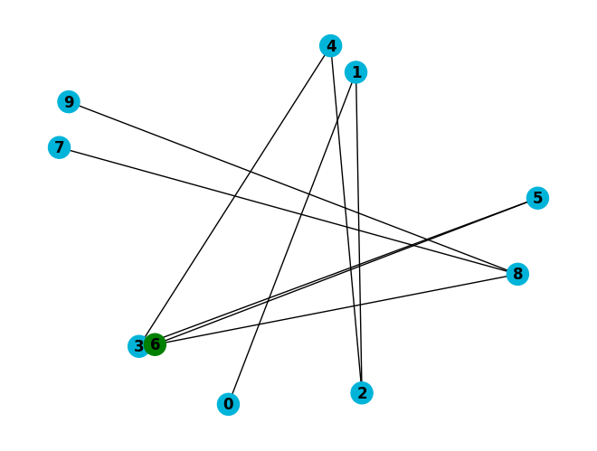

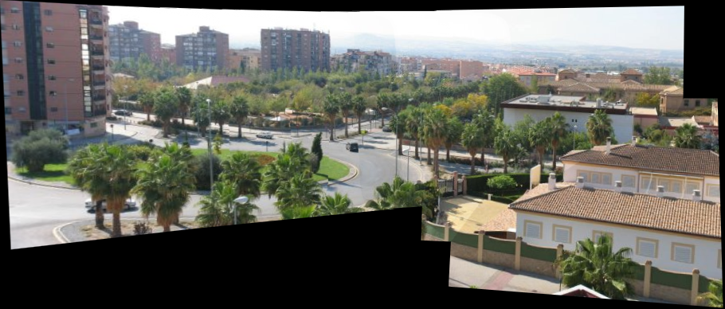

Panorama obtained with 6 as the source node obtained using the random method. 

## 5. Experimenting with different matchers

We have used 2 types of feature matchers- FLANN(Fast Library for Approximate Nearest Neighbors) and Brute Force(BF) matcher. We get different source nodes in case of the following panorama for FLANN and BF matchers.

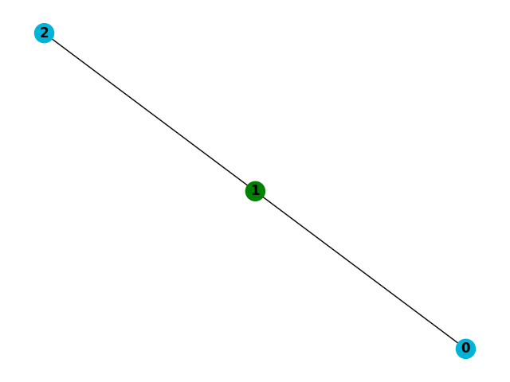

FLANN matcher : All images transformed to the frame of the middle image (node 1)

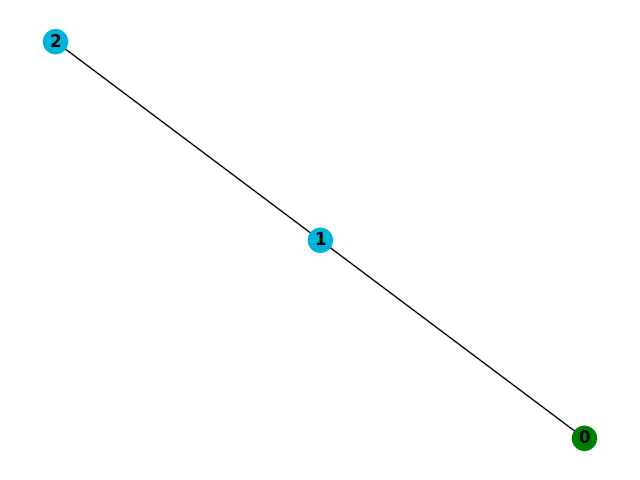

Brute Force matcher : All images transformed to the frame of the leftmost image (node 0)

## 6. UDIS-D comparison

We compare our results with the results of [UDIS](https://arxiv.org/pdf/2106.12859v1.pdf) **(Unsupervised Deep Image Stitching)** model on their dataset (UDIS-D). 

As mentioned above there is no exact metric to evaluate the image stitching and compare it with other model results other than manually comparing them based on the visual appearance.

From the above results we can clearly see that our algorithm almost replicates the results of the UDIS network model.

# Conclusion

The project presents a fully automated panorama stitching system. The invariant features and probabilistic model for match verification allows recognizing multiple panoramas in unordered image sets. The ability of the system to stitch all panoramas in a given image set with zero human intervention is what makes this project great.

The system is robust to camera zoom, orientation of the input images, and changes in illumination due to flash and exposure/aperture settings. A multi-band blending scheme ensures smooth transitions between images despite illumination differences, whilst preserving high frequency details.

# Future Work

One improvement that we feel could be done upon our project is the way we determine the source image in a panorama onto which all other images are transformed.

Choosing the image based on the number of matches sometimes gave a little distorted and poor result as compared to some cases when the source was selected randomly. So having a better heuristic for this to determine a plane onto which all images are transformed (not necessarily always source) would be really great.

# Work distribution

1. **Feature extraction and Probabilistic Model for Image Match Verification :**
    - Shreyash and Gautam
2. ************Bundle Adjustment :************
    - Shreyash and Gautam
3. **************************************Gain Compensation :**************************************
    - Mayank
4. **********************************Linear Blending :**********************************
    - Shreyash
5. ******************************************Multi Band Blending :******************************************
    - Gautam and Mayank

# References

1. Paper we have implemented : [http://matthewalunbrown.com/papers/ijcv2007.pdf](http://matthewalunbrown.com/papers/ijcv2007.pdf)
2. Homography Estimation : [https://www.hindawi.com/journals/mpe/2014/897050/](https://www.hindawi.com/journals/mpe/2014/897050/)